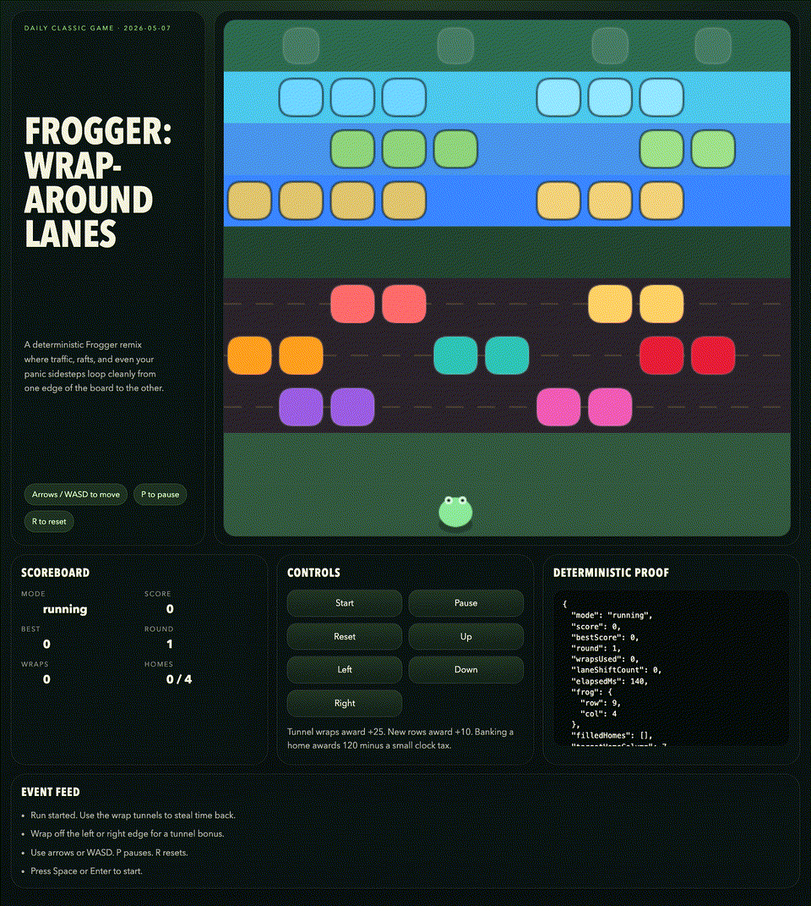
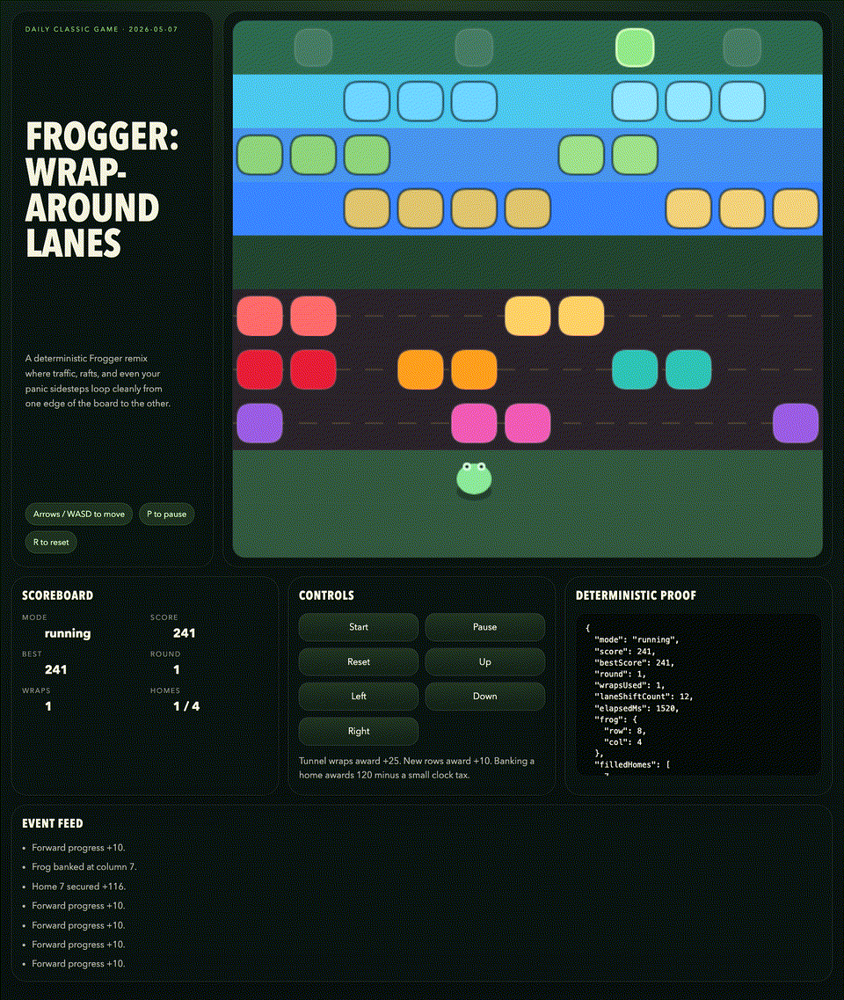
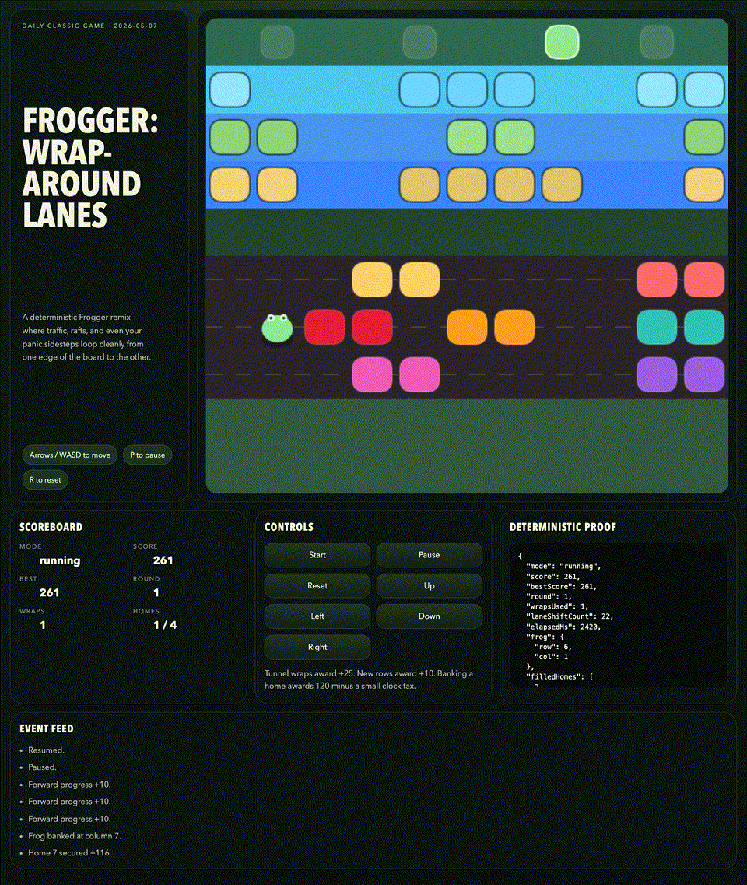

# daily-classic-game-2026-05-07-frogger-wrap-lanes

<p align="center"><strong>Deterministic Frogger with wrap tunnels, looping lanes, and a proof-friendly autoplay path.</strong></p>
<p align="center">Slide through traffic, ride wrap-around river supports, and bank lily homes before the clock tax trims each save bonus.</p>
<p align="center">
  
  
  
</p>

## Quick Start

```bash
pnpm install
pnpm dev
```

```bash
pnpm test
pnpm build
pnpm capture
```

## How To Play

- Press `Space` or `Enter` to launch the run.
- Move with the arrow keys or `WASD`.
- Press `P` to pause and `R` to reset the board to the title state.
- Reach the four lily homes across the river while avoiding the road lanes and open water.

## Rules

- Roads are fatal: if a vehicle occupies your tile, the run crashes immediately.
- River rows require support: if you are not standing on a raft or barge when the lane updates, you sink.
- Horizontal moves wrap cleanly from one edge of the board to the other.
- Filled lily homes stay occupied until all four are banked, then the round resets with slightly faster lane timing.

## Scoring

- `+10` for each new highest row reached during a crossing.
- `+25` for every wrap tunnel use.
- `+120` minus a small elapsed-time tax for each lily home secured.
- `+150` for clearing all four homes in a round.

## Twist

Every active lane is a loop. Traffic, river supports, and player sidesteps all wrap at the screen edges, turning the classic left/right boundary into a scoring shortcut instead of a dead stop.

## Verification

- `pnpm test`
- `pnpm build`
- `pnpm capture`
- Browser hooks:
  - `window.advanceTime(ms)`
  - `window.render_game_to_text()`
- Playwright proof files:
  - `artifacts/playwright/action_payload.json`
  - `artifacts/playwright/state-1.json`
  - `artifacts/playwright/state-2.json`
  - `artifacts/playwright/state-3-reset.json`

### GIF Captures

- `clip-01-opening-crossing.gif`: the autoplay opener threading the first crossing.
- `clip-02-wrap-shortcut.gif`: the wrap-tunnel shortcut that proves the twist and bonus scoring.
- `clip-03-pause-reset.gif`: pause overlay followed by the deterministic reset back to title.

## Project Layout

```text
assets/gifs/               Generated GIF captures
docs/plans/                Run-specific implementation plan
scripts/                   Self-check and Playwright capture scripts
src/                       Deterministic game core, autoplay, and UI
tests/                     Node-based gameplay verification
vercel.json                Static deployment settings
```
